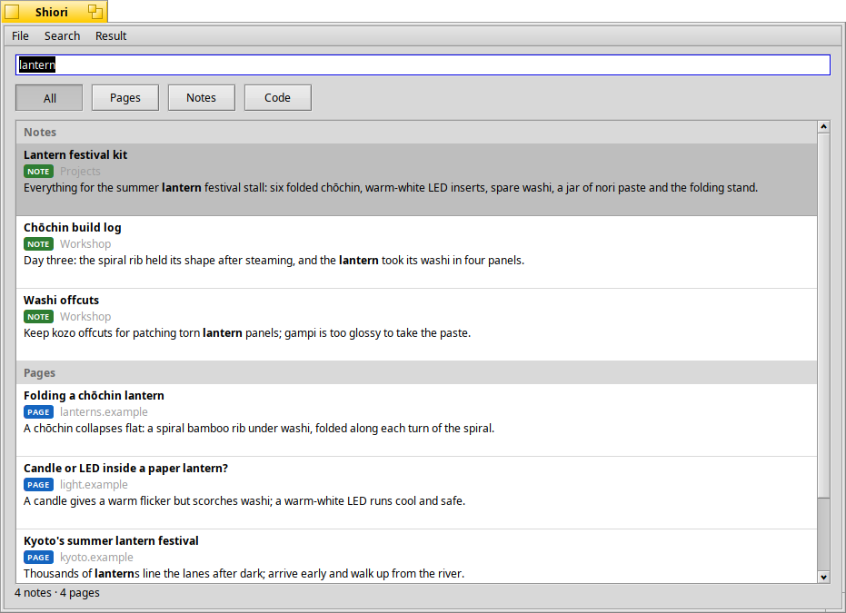
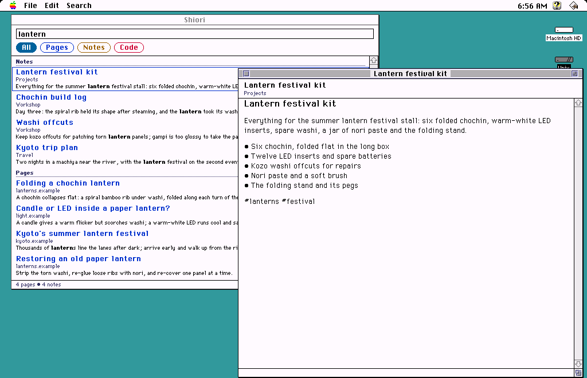

# Shiori

[Machiya](https://github.com/machiya-kobo/machiya) is a set of small self-hosted apps for finding what you've read: your pages ([Hister](https://github.com/asciimoo/hister)), the web ([SearXNG](https://github.com/searxng/searxng)), your notes ([Obsidian](https://obsidian.md)) and your code ([Forgejo](https://forgejo.org) or [GitHub](https://github.com)).

Shiori (栞, bookmark) is Machiya's search app. Search Hister and SearXNG from an iPhone, iPad, Mac, Linux, Haiku, a Classic Macintosh or the web. It's also a Hister extension for Safari on macOS and iOS, built on Hister's own and on Nick Burns's [hister-safari](https://github.com/nburns/hister-safari). Hister's [official extensions](https://hister.org/docs/browser-extension) also work.

Agentically coded with [Claude Code](https://docs.anthropic.com/en/docs/claude-code).

<p align="center">
<a href="https://machiya-kobo.github.io/">Machiya</a> · <a href="#quickstart">Quickstart</a> · <a href="docs/build.md">iPhone, iPad and Mac</a> · <a href="docs/extension.md">Safari</a> · <a href="docs/linux.md">Linux</a> · <a href="docs/haiku.md">Haiku</a> · <a href="docs/classic.md">Classic Macintosh</a> · <a href="web/README.md">Web</a> · <a href="docs/signing-in.md">Sign In</a> · <a href="#credits-and-license">License</a>
</p>

<p align="center"><a href="docs/screenshots/shiori-search-dark.png"></a><br>Everything everywhere all at once</p>

<table>
  <tr>
    <td align="center" width="33%"><a href="docs/screenshots/shiori-library-light.png"></a><br>Browse your library</td>
    <td align="center" width="33%"><a href="docs/screenshots/shiori-notes-light.png"></a><br>Read your notes</td>
    <td align="center" width="33%"><a href="docs/screenshots/shiori-settings-dark.png"></a><br>Pick a theme and your views</td>
  </tr>
</table>

<p align="center"><a href="docs/screenshots/shiori-library-phone-light.png"></a><br>Search from your phone</p>

## What it does

[Hister](https://github.com/asciimoo/hister) is a self-hosted personal search engine: its browser extension sends the full text of every page you visit (except the ones you skip) to your own Hister server. Shiori searches it. No Electron.

> **Unofficial.** Shiori is not affiliated with or endorsed by the Hister project.

- **Search your pages** with Hister's query syntax and completions. Filter by date, site, visits, language and type. What you open ranks first next time.
- **Search your notes** in your Obsidian vault, through Kura. A note opens in Obsidian, its Konbini card a tap away.
- **Search the World Wide Web** through your [SearXNG](https://github.com/searxng/searxng), your own pages mixed in, and Gemini and Gopher through a small-web gateway.
- **Search your code**: repos, issues, pull requests and releases from Forgejo and GitHub, imported into Hister.
- **Search your files**: the folders Hister watches ([local directory indexing](https://hister.org/docs/configuration#local-directory-indexing)).
- **Browse and read** everything Hister holds, by label, collection (`@reading`) or day, as readable copies with scripts off.
- **Save pages** from the share sheet on iPhone, iPad and Mac, by address, or with Shortcuts and Siri.
- **Offline support.** Saves wait on the device and go when you're back on The Internet.
- **Label, share, export or delete.** Lists export as JSON, CSV or RSS.
- **Pick a theme**: Tokyo Night, Solarized, Nord, Dracula, Catppuccin, Gruvbox, Rosé Pine, Kanagawa, Everforest or Ayu, light and dark.
- **Take your settings along.** Signed in to Hister, your theme, text size and views follow you to every device.

[Every feature](docs/features.md). Shiori needs only a Hister; Kura, Konbini and SearXNG are optional. It talks only to the servers you set. AI is off until you pick a provider ([docs/ai.md](docs/ai.md)). No analytics.

## Quickstart

Run a Hister with a dozen invented pages, then Shiori's search page and web app, on this machine. You need `git`, `bash`, `python3`, `curl`, and `podman` or `docker`. Ports 4433, 8765 and 8766 must be free.

**1. Get the code**

```bash
git clone https://github.com/machiya-kobo/shiori && cd shiori
```

**2. Start Hister and add the sample pages.** Hister listens on this machine only. With Docker, type `docker` for `podman`.

<!-- quickstart: hister-podman -->
```bash
podman run -d --name shiori-hister -p 127.0.0.1:4433:4433 \
  -e HISTER__SERVER__ADDRESS=0.0.0.0:4433 -e HISTER__SERVER__BASE_URL=http://localhost:4433 \
  ghcr.io/asciimoo/hister:v0.20.0
```

<!-- quickstart: seed -->
```bash
tools/quickstart/seed-hister.py http://127.0.0.1:4433/
```

**3. Build the search page and the web app**

<!-- quickstart: pages-build -->
```bash
scripts/build-web.sh demo-site http://localhost:8765/
scripts/build-pwa.sh demo-app
```

**4. Serve them**, each in its own terminal, from the `shiori` folder:

<!-- quickstart: serve-search background -->
```bash
HISTER_URL=http://127.0.0.1:4433/ web/dev-server.py demo-site
```

<!-- quickstart: serve-app background -->
```bash
HISTER_URL=http://127.0.0.1:4433/ PORT=8766 web/dev-server.py demo-app
```

| App | Address |
|---|---|
| The search page | http://localhost:8765/?q=lantern |
| The web app | http://localhost:8766/ |
| Hister | http://localhost:4433/ |

The search page finds five lantern pages, and the web app's Library holds all twelve. To stop, press Ctrl-C in both terminals, then run `podman rm -f shiori-hister`.

### Next

- **Check every step as you go,** with packages for Debian and the BSDs: [the full, tested walkthrough](docs/quickstart.md).
- **Add your notes and the web:** [run it with Machiya](docs/quickstart.md#b-as-one-of-the-machiya-services), next to Kura, Konbini and SearXNG.
- **Use it from your phone and laptop:** [host the pages](web/README.md) behind your own network.
- **Sign in** to Hister and Machiya, when they have users: [signing in](docs/signing-in.md).
- **Save pages as you browse:** [Shiori's Safari extension](docs/extension.md), or Hister's [official extensions](https://hister.org/docs/browser-extension) for Firefox and Chrome.

## Get the apps

### iPhone, iPad and Mac

Build them with Xcode 27 and a free Apple ID, then turn on the extension: [docs/build.md](docs/build.md).

### Linux

A Flatpak around the web app, with Cinnamon's menu search, a quick-search hotkey and `shiori save`: [docs/linux.md](docs/linux.md).

### Haiku

A native app on the Be API, installed with `pkgman` or built with `make`: [docs/haiku.md](docs/haiku.md).

<p align="center"><a href="docs/screenshots/shiori-haiku-search.png"></a><br>Native on Haiku</p>

### Classic Macintosh

A native app for 68k Macs, with a quick-search desk accessory: [docs/classic.md](docs/classic.md).

<p align="center"><a href="docs/screenshots/shiori-classic-system7-color.png"></a><br>Color on System 7</p>

## Credits and license

- [Hister](https://github.com/asciimoo/hister) by Adam Tauber (asciimoo) and contributors: the search engine Shiori searches, and the extension it builds for Safari.
- [hister-safari](https://github.com/nburns/hister-safari) by Nick Burns (AGPL-3.0): the macOS Safari port Shiori's extension started from. Its design (Hister's source pinned, Safari-only patches applied to the built bundle), build pipeline, manifest merge and Safari shims are the base of Shiori's; Shiori adds the offline queue, settings shared with the app, the search page and the iPhone and iPad build.

Copyright (C) 2026 Micheal Waltz and Machiya contributors.

Shiori is free software under the GNU Affero General Public License, version 3 or (at your option) any later version: see [LICENSE](LICENSE). If you change Shiori and let others use it over a network, build with `SHIORI_SOURCE_URL` so About links your source. What it ships from other projects is listed with their licenses in [THIRD_PARTY_NOTICES](THIRD_PARTY_NOTICES). Contributions are welcome: [CONTRIBUTING.md](CONTRIBUTING.md); report a vulnerability privately: [SECURITY.md](SECURITY.md).
