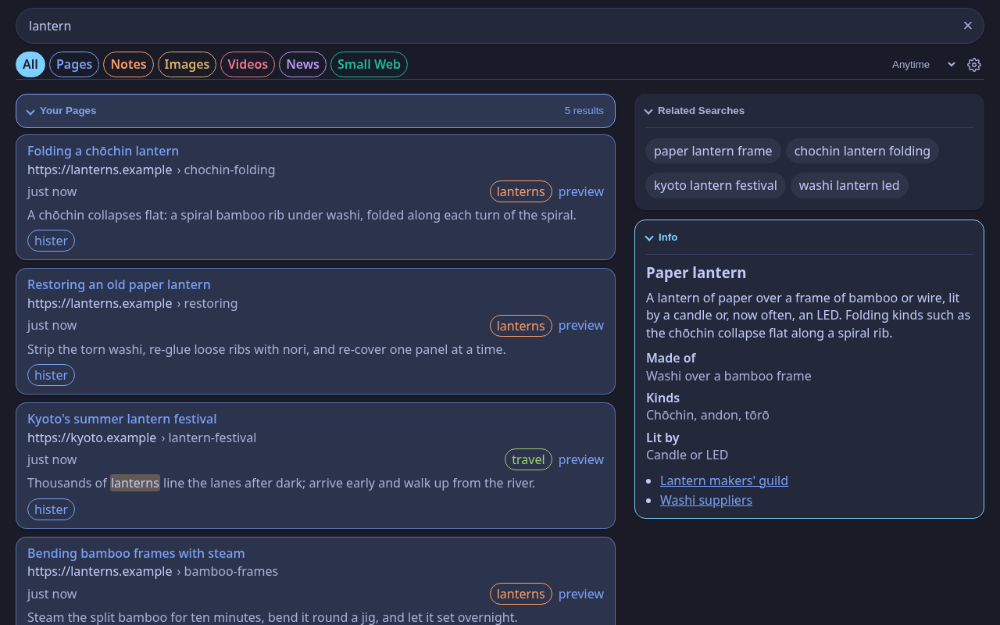
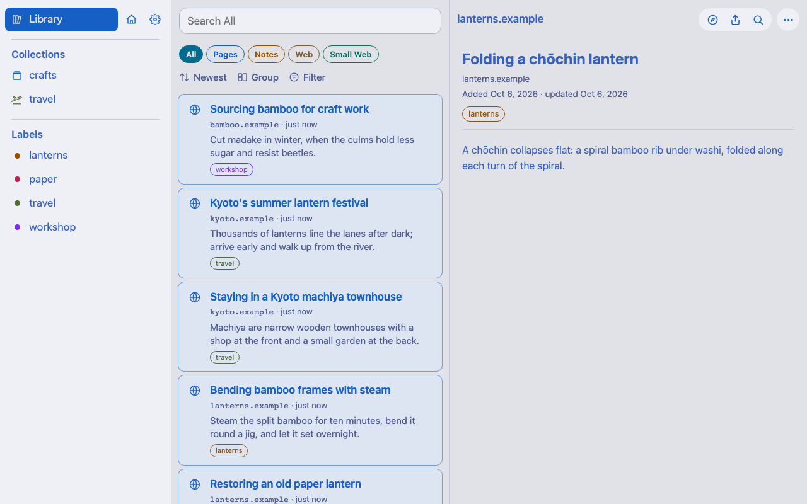
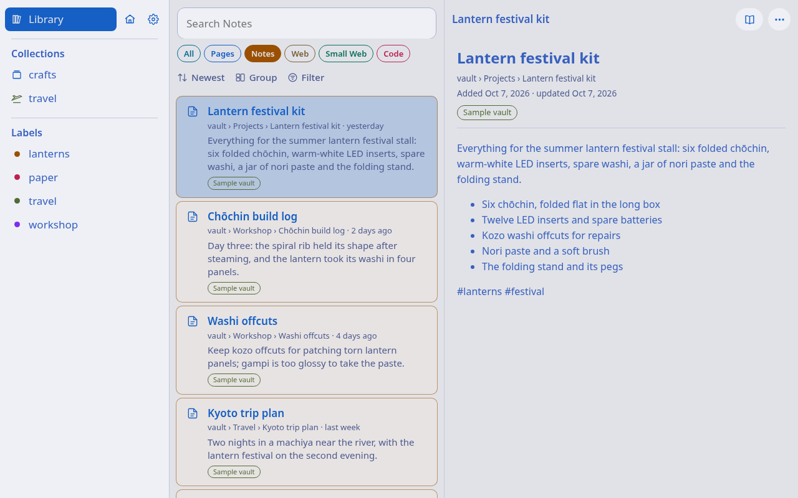
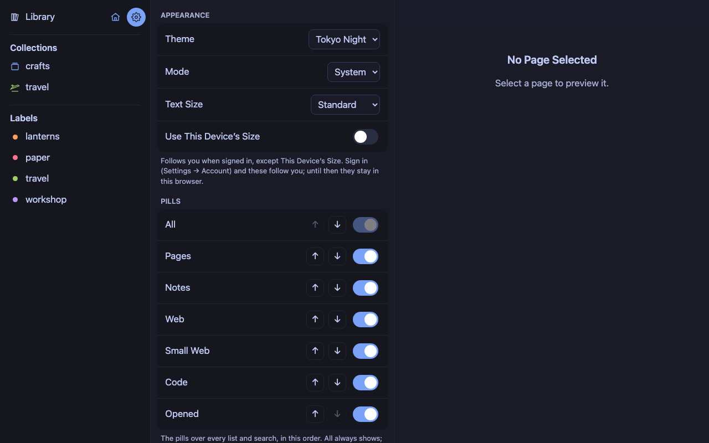
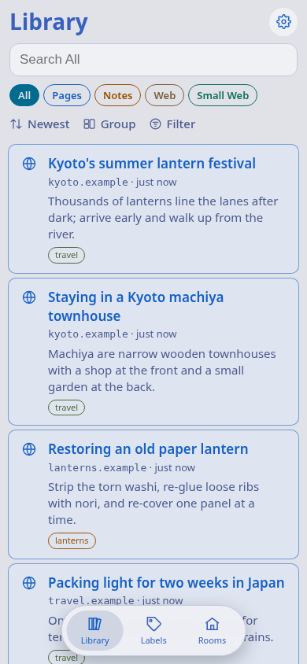

# Shiori

[Machiya](https://github.com/machiya-kobo/machiya) is a set of small self-hosted apps for finding what you've read: your pages ([Hister](https://github.com/asciimoo/hister)), the web ([SearXNG](https://github.com/searxng/searxng)), your notes ([Obsidian](https://obsidian.md)) and your code ([Forgejo](https://forgejo.org) or [GitHub](https://github.com)).

Shiori (栞, "bookmark") is the search app for Machiya and searches Hister and SearXNG from iPhone, iPad, Mac, Linux, Haiku and the web. It's also a Hister extension for Safari on macOS and iOS, or you can use Hister's [official](https://hister.org/docs/browser-extension) or [third-party](https://github.com/nburns/hister-safari) extensions.

<p align="center">
<a href="https://machiya-kobo.github.io/machiya/">Machiya</a> · <a href="#what-it-does">Features</a> · <a href="#quickstart">Quickstart</a> · <a href="#sign-in-to-hister">Sign In</a> · <a href="#the-safari-extension">Safari</a> · <a href="#build">Build</a> · <a href="#linux">Linux</a> · <a href="#haiku">Haiku</a> · <a href="#hosting-the-web-pages">Hosting</a> · <a href="#credits-and-license">License</a>
</p>

<p align="center"><a href="docs/screenshots/shiori-search-dark.png"></a><br>Everything everywhere all at once</p>

<table>
  <tr>
    <td align="center" width="33%"><a href="docs/screenshots/shiori-library-light.png"></a><br>Browse your library</td>
    <td align="center" width="33%"><a href="docs/screenshots/shiori-notes-light.png"></a><br>Read your notes</td>
    <td align="center" width="33%"><a href="docs/screenshots/shiori-settings-dark.png"></a><br>Pick a theme and your views</td>
  </tr>
</table>

<p align="center"><a href="docs/screenshots/shiori-library-phone-light.png"></a><br>Search from your phone</p>

## What it does

[Hister](https://github.com/asciimoo/hister) is a self-hosted personal search engine: its browser extension sends the full text of every page you visit (except the ones you skip) to your own Hister server. Shiori searches it. Native apps for iPhone, iPad, Mac, Linux and Haiku, and web apps for everything else. No Electron.

> **Unofficial.** Shiori is not affiliated with or endorsed by the Hister project.

- **Search your pages** with Hister's query syntax, completions included. Filter by date, site, visits, language and type.
- **Search your notes**: your Obsidian vault, through Kura. A note opens in Obsidian, its Kura page and Konbini card a tap away.
- **Search the World Wide Web** through your [SearXNG](https://github.com/searxng/searxng), your own pages mixed in and the ones you've visited marked.
- **Search Gemini and Gopher** through a small-web gateway.
- **Search your code** in the Code view: repos, READMEs, docs, issues, pull requests and releases imported into Hister. Filter by kind, forge, open or private; each opens at its forge.
- **Search your files** in the Files view: the folders Hister watches ([local directory indexing](https://hister.org/docs/configuration#local-directory-indexing)), opened from Hister's copy.
- **Browse** everything Hister holds, newest first, by label and collection (Hister's `@` aliases, like `@reading`), or by day and month.
- **Read a page** as Hister's readable copy, scripts off, no referrer. Earlier versions, Show As, full screen, and images large on tap.
- **Label, share or delete** a page. A delete checks that exactly one page matches, and waits for Undo.
- **Save pages** from the share sheet on iPhone, iPad and Mac, by address (Add Page, ⇧⌘A on the Mac), or with Shortcuts and Siri ("Search Hister", "Save URL to Hister"), with an optional label.
- **Offline support.** Saves wait on the device, out of your backups, and go when Hister answers. After 14 days they're dropped.
- **Remember what you open**: Hister puts it first the next time you search the same words. Your last 5 searches stay on the device (Settings → Results → History).
- **Subscribe** to any search, collection or label as RSS (all collections at once as OPML, for NewsBlur), through a companion feed service on the Hister host, not in this repository: `GET /shiori/feed?q=<query>[&title=…][&exclude_label=…]`, answering RSS 2.0 with the 50 newest matches.
- **Export** any list as JSON, CSV or RSS.
- **Pick a theme**: Tokyo Night, Solarized, Nord, Dracula, Catppuccin, Gruvbox, Rosé Pine, Kanagawa, Everforest or Ayu, light and dark, and a text size of your own, on the Mac too.
- **Take your settings along.** Signed in to Hister, your theme, text size, views and results options follow you to every device and Machiya app. Addresses, sign-ins, AI and Use This Device's Size stay put.

Shiori talks only to the servers you configure: Hister and, if you set them, SearXNG, Kura, Konbini, a small-web gateway and the feed service, plus the AI providers you switch on (Settings → AI, off by default). Safari's extension also fetches the favicons and PDFs of the sites you visit, as upstream's does. A file never goes to an AI, and code only to an on-device model. Switch off Settings → Results → Images in Previews and a preview loads nothing from elsewhere. No analytics.

**Part of Machiya.** Each [Machiya](https://github.com/machiya-kobo/machiya) app is a *room*: Kura (a notes search and reader), Konbini (a project board), Niwa (a published notes garden) and Shiori. Shiori needs only a Hister; the other rooms are optional.

## Quickstart

Two ways in: **A. standalone**, with a Hister and invented sample pages, or **B. with Machiya**, next to Kura, Konbini, Niwa and SearXNG. `tools/quickstart-test` runs every block marked `quickstart:` exactly as written, on clean machines: Debian for all of it, OpenBSD, FreeBSD and NetBSD for the web pages. **Not machine-tested:** the Mac, iPhone and iPad apps (they need Xcode, a signing team and a device), and Cinnamon's menu search and hotkey (they need a desktop session). Their steps are below, in [Build](#build) and in [docs/linux.md](docs/linux.md), checked by hand.

**You need** `git`, `bash`, `python3` and `curl`, `podman` (or `docker`) for Hister, and Debian (or any Linux with Flatpak) for the Linux app. Ports 4433, 8765 and 8766 must be free.

*Debian or Ubuntu* (everything, the Linux app included):

<!-- quickstart: packages-debian -->
```bash
sudo apt-get update
sudo apt-get install -y git curl python3 podman flatpak flatpak-builder dbus-bin
```

On the BSDs, run the package block as root: a fresh FreeBSD or NetBSD has no `sudo`, and OpenBSD's `doas` needs an `/etc/doas.conf` first.

*OpenBSD* (the web pages):

<!-- quickstart: packages-openbsd -->
```bash
pkg_add python%3 git curl bash
```

*FreeBSD* (the web pages):

<!-- quickstart: packages-freebsd -->
```bash
pkg install -y python3 git curl bash
```

*NetBSD* (the web pages; its packages name Python by version, so give it a `python3`):

<!-- quickstart: packages-netbsd -->
```bash
export PKG_PATH="https://cdn.NetBSD.org/pub/pkgsrc/packages/NetBSD/$(uname -p)/$(uname -r | cut -d_ -f1)/All"
pkg_add python313 git-base curl bash
ln -sf /usr/pkg/bin/python3.13 /usr/pkg/bin/python3
```

The BSDs have no podman or docker. Run Hister on another machine (or natively, as Machiya's [docs/install/bsd.md](https://github.com/machiya-kobo/machiya/blob/main/docs/install/bsd.md) describes) and point step 2's `HISTER_URL` at it. Without one, the results check has nothing to show.

Then get the code: `git clone https://github.com/machiya-kobo/shiori && cd shiori`. The Mac and iOS builds also need `git submodule update --init` (the Safari extension is built from Hister's own).

### A. Standalone, with sample pages

**1. A Hister with sample pages**, listening on this machine only.

*With podman:*

<!-- quickstart: hister-podman -->
```bash
podman run -d --name shiori-hister -p 127.0.0.1:4433:4433 \
  -e HISTER__SERVER__ADDRESS=0.0.0.0:4433 -e HISTER__SERVER__BASE_URL=http://localhost:4433 \
  ghcr.io/asciimoo/hister:v0.20.0
```

*With docker:*

<!-- quickstart: hister-docker -->
```bash
docker run -d --name shiori-hister -p 127.0.0.1:4433:4433 \
  -e HISTER__SERVER__ADDRESS=0.0.0.0:4433 -e HISTER__SERVER__BASE_URL=http://localhost:4433 \
  ghcr.io/asciimoo/hister:v0.20.0
```

Fill it with a dozen invented pages from a paper-lantern workshop and a Kyoto trip. The script writes only to a Hister on this machine.

<!-- quickstart: seed -->
```bash
tools/quickstart/seed-hister.py http://127.0.0.1:4433/
```

<!-- quickstart-expect: seed -->
```text
Added 12 sample pages to http://127.0.0.1:4433/
```

**2. The search page and the web app**, built and served the way a real host routes them (bash and Python 3, nothing else):

<!-- quickstart: pages-build -->
```bash
scripts/build-web.sh demo-site http://localhost:8765/
scripts/build-pwa.sh demo-app
```

Serve each in its own terminal (or end the line with `&`):

<!-- quickstart: serve-search background -->
```bash
HISTER_URL=http://127.0.0.1:4433/ web/dev-server.py demo-site
```

<!-- quickstart: serve-app background -->
```bash
HISTER_URL=http://127.0.0.1:4433/ PORT=8766 web/dev-server.py demo-app
```

Check that both answer and reach Hister:

<!-- quickstart: pages-check -->
```bash
curl -s http://localhost:8765/_shiori/opensearch.xml | grep -o '<ShortName>[^<]*</ShortName>'
curl -s http://localhost:8766/manifest.webmanifest | python3 -c 'import json,sys; print(json.load(sys.stdin)["name"])'
```

<!-- quickstart-expect: pages-check -->
```text
<ShortName>Shiori</ShortName>
Shiori
```

<!-- quickstart: results-check -->
```bash
curl -s 'http://localhost:8765/search?format=json&query=%7B%22text%22%3A%22lantern%22%7D' \
  | python3 -c 'import json,sys; print(*sorted(d["title"] for d in json.load(sys.stdin)["documents"]), sep="\n")'
```

<!-- quickstart-expect: results-check -->
```text
Bending bamboo frames with steam
Candle or LED inside a paper lantern?
Folding a chōchin lantern
Kyoto's summer lantern festival
Restoring an old paper lantern
```

Open <http://localhost:8765/?q=lantern> and Shiori lists those pages (the web needs SearXNG, part B). <http://localhost:8766/> is the web app, with all twelve in its Library and their labels in the sidebar. For a real host, [web/README.md](web/README.md) has the routing table.

**3. Shiori for Linux** (Debian 13 here; any distribution with Flatpak works the same): the GNOME runtime, then the app, installed for your user.

<!-- quickstart: linux-build -->
```bash
flatpak remote-add --user --if-not-exists flathub https://dl.flathub.org/repo/flathub.flatpakrepo
flatpak install --user -y flathub org.gnome.Platform//49 org.gnome.Sdk//49
linux/flatpak/build.sh
```

The bundle (`shiori.flatpak`, to install elsewhere) lands in `~/.cache/shiori-flatpak/`.

Point it at Hister and the web app, and search as the desktop search does. Over SSH with no desktop, put `dbus-run-session --` in front of `flatpak run`. This writes `~/.config/shiori/config.json`, so back up your own first (`cp ~/.config/shiori/config.json ~/.config/shiori/config.json.bak`).

<!-- quickstart: linux-check -->
```bash
mkdir -p ~/.config/shiori
echo '{"webApp": "http://localhost:8766/", "server": "http://127.0.0.1:4433/"}' > ~/.config/shiori/config.json
flatpak run io.github.machiya_kobo.Shiori provider-search lantern \
  | python3 -c 'import json,sys; print(*sorted(r["name"] for r in json.load(sys.stdin)), sep="\n")'
```

<!-- quickstart-expect: linux-check -->
```text
Bending bamboo frames with steam
Candle or LED inside a paper lantern?
Folding a chōchin lantern
Kyoto's summer lantern festival
Restoring an old paper lantern
```

`flatpak run io.github.machiya_kobo.Shiori` opens the window. `linux/install-desktop.sh` adds the `shiori` command and, on Cinnamon, the menu search and Ctrl+Alt+Space. It changes your running desktop session's settings; `--remove` undoes it ([docs/linux.md](docs/linux.md)).

**4. The Mac, iPhone and iPad apps** (not machine-tested). On a Mac with Xcode 27 and [Homebrew](https://brew.sh): `git submodule update --init`, `brew bundle`, `cp local.yml.example local.yml`. In `local.yml` set `DEVELOPMENT_TEAM` (Xcode → Settings → Accounts), `SHIORI_BUNDLE_PREFIX` (a reverse-DNS prefix of your own, such as `io.github.you`) and `SHIORI_SERVER_URL` (`http://<this machine's address>:4433/`). `scripts/install-mac.sh` installs the Mac app, and `scripts/deploy-device.sh` an iPhone or iPad (`DEVICE_NAME` in `local.env`). Then [turn the extension on](#turn-it-on).

**Stop:** end the two servers (Ctrl+C), then remove Hister:

<!-- quickstart: stop-podman -->
```bash
podman rm -f shiori-hister
```

<!-- quickstart: stop-docker -->
```bash
docker rm -f shiori-hister
```

### B. As one of the Machiya services

Clone `machiya`, `kura`, `niwa`, `konbini` and `shiori` side by side, and bring the stack up with the [Machiya Quickstart](https://github.com/machiya-kobo/machiya#quickstart): Hister, SearXNG, Kura with the sample vault, Konbini and Niwa on this machine's ports, with no sign-in. Then, in `shiori`, build the pages with the rooms' addresses (the stack's defaults). `SHIORI_NIWA_URL` is your Kura (the name is older than Kura):

<!-- quickstart: stack-pages-build -->
```bash
export SHIORI_NIWA_URL=http://localhost:8083/ SHIORI_KONBINI_URL=http://localhost:8081/
export SHIORI_ROOMS="kura=http://localhost:8083/,konbini=http://localhost:8081/,niwa=http://localhost:8082/,hister=http://localhost:4433/,searxng=http://localhost:8888/"
scripts/build-web.sh demo-site http://localhost:8765/
scripts/build-pwa.sh demo-app
```

Serve them, routed to every room:

<!-- quickstart: stack-serve-search background -->
```bash
HISTER_URL=http://127.0.0.1:4433/ SEARXNG_URL=http://127.0.0.1:8888/ KURA_URL=http://127.0.0.1:8083/ \
  KONBINI_URL=http://127.0.0.1:8081/ web/dev-server.py demo-site
```

<!-- quickstart: stack-serve-app background -->
```bash
HISTER_URL=http://127.0.0.1:4433/ SEARXNG_URL=http://127.0.0.1:8888/ KURA_URL=http://127.0.0.1:8083/ \
  KONBINI_URL=http://127.0.0.1:8081/ PORT=8766 web/dev-server.py demo-app
```

The notes come from Kura, through the same host:

<!-- quickstart: stack-check -->
```bash
curl -s 'http://localhost:8765/kura/api/search?q=lantern&limit=50' \
  | python3 -c 'import json,sys; print(*sorted(r["title"] for r in json.load(sys.stdin)["results"]), sep="\n")' | grep -x 'Lantern festival kit'
```

<!-- quickstart-expect: stack-check -->
```text
Lantern festival kit
```

<http://localhost:8765/?q=lantern> now has the sample vault's notes, each with its Kura page and Konbini card, and the web from SearXNG. The stack's Hister holds only the notes: for pages too, run part A's `tools/quickstart/seed-hister.py http://127.0.0.1:4433/`. The web app's Notes view lists the vault, and the house button switches rooms. Add `SHIORI_SMALLWEB_URL` (and a `SMALLWEB_URL` route) for Gemini and Gopher, and `SHIORI_SOURCE_URL` (your fork's address) for the Source link in About.

The Linux app takes Kura the same way. This replaces `~/.config/shiori/config.json` again, so back up your own first:

<!-- quickstart: stack-linux-check -->
```bash
mkdir -p ~/.config/shiori
echo '{"webApp": "http://localhost:8766/", "server": "http://127.0.0.1:4433/", "kura": "http://127.0.0.1:8083/"}' > ~/.config/shiori/config.json
flatpak run io.github.machiya_kobo.Shiori provider-search lantern \
  | python3 -c 'import json,sys; print(*sorted(r["name"] for r in json.load(sys.stdin) if r["kind"] == "note"), sep="\n")' | grep -x 'Lantern festival kit'
```

<!-- quickstart-expect: stack-linux-check -->
```text
Lantern festival kit
```

The Mac and iOS apps take the same addresses in `local.yml` (`SHIORI_SEARXNG_URL`, `SHIORI_NIWA_URL`, `SHIORI_KONBINI_URL`, `SHIORI_SMALLWEB_URL`) or in Settings.

## Sign in to Hister

No sign-in while Hister has no users (the default). When it has them (`app.user_handling`, v0.20.0+, with Machiya's sign-in helper on Hister's host), sign in once on each:

- **The apps:** Settings → Account → Sign in to Hister (shown only while Hister has users): **Sign In with Tailscale** when Hister offers its OIDC sign-in, else **Sign In with Saved Password** (Hister's page, where your saved password is offered), or a name and password. Kept in the Keychain.
- **Safari's extension:** paste your Hister user's token into the app (Settings → Account → Safari Extension Token) on each device with the extension.
- **The hosted pages** send you to Hister's sign-in and back.
- **Linux:** `shiori sign-in` (a small window) and `shiori sign-out`, or `"histerToken"` in config.json. **Haiku:** Settings → Sign In…, or `"histerToken"` in config.json.

The session goes only to your Hister. Kura and Konbini get an opaque id when you're signed in, else the token, so they know who's asking. [docs/signing-in.md](docs/signing-in.md) has the details.

## Sign in to Machiya

No sign-in unless Machiya's identity file is on (off by default). Then Kura and Konbini ask who's calling, and each Shiori signs in once:

- **With a pairing code** (easiest): on the server, `python3 -m vaultkit.identity pair <you> --label iPhone` shows a one-time code for ten minutes. Type it into Shiori, which trades it with Kura for a device token.
- **Or with a token** from `python3 -m vaultkit.identity token mint <you> --label iPhone`, pasted in.

On iPhone, iPad and Mac: Settings → Account → Sign in to Machiya (kept in the Keychain; Safari's extension asks the app). On Linux: `"machiyaToken"` in `~/.config/shiori/config.json` (`shiori pair <code>` prints it). The hosted pages use Kura's own `/signin` cookie. The token goes only to the configured Kura and Konbini, never to Hister or SearXNG. Sign Out deletes it from the device; revoke it on the server. [docs/signing-in.md](docs/signing-in.md) has the details, and [Machiya's identity guide](https://github.com/machiya-kobo/machiya/blob/main/docs/identity.md) sets up the server side.

## The Safari extension

Hister's [official extensions](https://hister.org/docs/browser-extension) cover Firefox and Chrome, and [hister-safari](https://github.com/nburns/hister-safari) brings it to Safari on the Mac. Safari on iPhone and iPad loads only extensions that ship inside a signed app, so Shiori carries Hister's own extension, built for Safari. It runs on the Mac too: there, use Shiori's or hister-safari, not both.

**Search from Safari's address bar** (Settings → Safari → Search from Safari, on by default). Keep DuckDuckGo as Safari's search engine, and address-bar searches open Shiori instead: your pages and notes first, then the web from your SearXNG. `!bangs` still go to DuckDuckGo. If SearXNG doesn't answer, your own pages stay; with none, you land on DuckDuckGo. Thumbnails come only through your SearXNG's `/image_proxy`, so the device never contacts the engines' image hosts. Stock SearXNG proxies images only in its HTML, so its JSON needs a plugin (not in this repository); without one, no thumbnails.

### How it's built

- `vendor/hister/` pins the **official upstream extension** as a git submodule (currently **v0.20.0**, extension 0.31.0). It is never modified or forked.
- `scripts/build-extension.sh` builds it with npm, then patches the built bundle: `patches/manifest.shiori.json` and `patches/manifest.safari.json` (icons, name, Shiori's shortcuts, no `cookies` permission); `patches/safari-shims.js`, `patches/ext/host-native.js`, `patches/ext/core.js` (the offline queue, tagged captures, combined search), `patches/shiori/search-core.js`, `patches/ext/badge.js` and `patches/ext/menus.js` prepended to `background.js`; `patches/safari-content-shim.js` (the size cap) to `content.js`; and `patches/safari-popup.css` for touch screens.
- `project.yml` ([XcodeGen](https://github.com/yonaskolb/XcodeGen)) generates one Xcode project: an iOS/iPadOS app, a macOS app, and a Safari Web Extension for each. `Packages/HisterKit` is the Hister API client, query suggestions and the themes, tested with `swift test`.

The popup, skip rules, "index this page", "skip this page/domain" and PDF indexing are upstream's own.

### Safari-only behavior

- **Offline queue.** With the server out of reach, a captured page waits on the device, stamped with your visit's time, and goes when the server answers: the newest 100 pages (24 M characters at most), one per URL, for up to 14 days, with no credentials stored. Pages the server refuses (a skip rule, too large, sensitive content) are dropped. Nothing is queued until the skip rules have been fetched once, and they still apply offline. A new server address takes the queue with it.
- **Waiting count** on the Mac's toolbar button; Settings → Account → Waiting to Send shows it everywhere.
- **Right-click menu** (the Mac): Search Shiori for the selection; upstream's Save Page to Hister, Never Save This Page and Never Save This Site; Save Link to Hister (never a file or a page Hister has; `gemini://` and `gopher://` through the small-web gateway).
- **Sites never saved:** Safari has no containers. Turn Shiori off in a Safari profile (Safari Settings → Profiles → Extensions) and browse them there.
- **Size cap.** Page HTML over 2 M characters is cut at a tag boundary, never dropped: Mobile Safari kills extensions that use too much memory. Hister reads the text from the HTML; text alone is capped at 1 M.
- **Tagged captures:** `metadata.client: "shiori"` and `metadata.client_version` on every page (search `metadata.client:shiori`).
- **No cookies permission:** the popup's "Authenticate with Browser Session" won't work. Use an access token, or a server gated by your network. The popup is full width on iPhone and iPad.
- **Keyboard shortcuts:** Control-Shift-S saves the page, P never saves this page, D never this site, F opens Shiori. Change them in Safari Settings on the Mac.

## Build

Needs macOS with Xcode 27 or later, the tools in `Brewfile` (Node.js and XcodeGen), and an Apple ID. A free Personal Team is enough for your own devices, re-signed every 7 days.

```bash
git clone --recurse-submodules <this repo>
cd shiori
brew bundle
cp local.yml.example local.yml   # your team, bundle prefix and servers
cp local.env.example local.env   # your device name, for deploys
node --test scripts/*.test.mjs   # manifest + shim tests
(cd Packages/HisterKit && swift test)
scripts/build.sh ios             # or: scripts/build.sh macos
```

The submodule matters: the Safari extension is built from Hister's own. In `local.yml` set:

- **`DEVELOPMENT_TEAM`**: your team ID, from Xcode → Settings → Accounts.
- **`SHIORI_BUNDLE_PREFIX`**: a reverse-DNS prefix of your own, such as `io.github.you` (bundle IDs are unique across Apple). The app becomes `<prefix>.shiori`, its extensions `.Extension` and `.Share`, the App Group `group.<prefix>.shiori` (iOS) or `<TeamID>.<prefix>.shiori` (macOS). The build stops until it's set.
- **`SHIORI_SERVER_URL`**: your Hister, with the trailing slash, baked in as the app's and the extension's default (both can change it). Unset, the extension gets upstream's `http://127.0.0.1:4433/` and the app asks.
- Optionally **`SHIORI_NIWA_URL`** (your Kura; the name is older than Kura), **`SHIORI_KONBINI_URL`** and **`SHIORI_SEARXNG_URL`**, and the rest of `local.yml.example`. Anything unset is left for Settings.

Install on an iPhone or iPad, or on the Mac:

```bash
scripts/deploy-device.sh         # the device named DEVICE_NAME in local.env
scripts/install-mac.sh           # a signed Release in /Applications, replacing any earlier copy
```

Then [turn it on](#turn-it-on). Use one Hister extension in Safari, not both: if hister-safari is on, turn one of them off, or Safari sends every page twice. Never edit `Shiori.xcodeproj` or `ShioriExtension/Resources/` (both generated): change `project.yml` or `patches/`.

## Turn it on

**iPhone and iPad:** Settings → Apps → Safari → Extensions → Shiori. Turn it on, set **All Websites** to **Allow**, and leave **Allow in Private Browsing** off. In Safari, tap the Page Menu button left of the address bar → Shiori to check the server address. A reinstall sets All Websites back to Ask, without a word: set it again.

**Mac:** open Shiori, click **Open Safari Extensions Settings…**, turn on Shiori, and allow it on every website. A build signed with your team stays on; an ad-hoc build needs Develop → Allow Unsigned Extensions after every Safari restart.

## Linux

A small GTK app (GJS, GTK 4, libadwaita, WebKitGTK) around the web app, plus what a web page can't do: Cinnamon's menu search, a quick-search window on a hotkey, `shiori save <url> [label]` with an offline queue, and saving a note's links. A Flatpak on the GNOME 49 runtime; [docs/linux.md](docs/linux.md) has the details.

```bash
flatpak remote-add --user --if-not-exists flathub https://dl.flathub.org/repo/flathub.flatpakrepo
flatpak install --user flathub org.gnome.Platform//49 org.gnome.Sdk//49   # needs flatpak-builder too
linux/flatpak/build.sh                 # builds, installs for you, and writes a single-file bundle
linux/install-desktop.sh               # the `shiori` launcher, Cinnamon's menu search, Ctrl+Alt+Space
```

Then point it at your servers in `~/.config/shiori/config.json`:

```json
{"webApp": "https://<your Shiori web app>/", "server": "https://<your Hister>/", "kura": "https://<your Kura>/"}
```

`linux/install-desktop.sh --remove` undoes the desktop pieces. A bundle someone built for you installs with `flatpak install --user shiori.flatpak`.

## Haiku

A native C++ app on the Be API: search your pages and notes (All, Pages, Notes, Code), preview a note from Kura, save a web page to Hister (with an offline outbox), and quick-search from the Deskbar. Install the `.hpkg` from a release (`pkgman install ./shiori-*.hpkg`), or build it on Haiku with `cd haiku && make && ./package.sh`. [docs/haiku.md](docs/haiku.md) has the details.

## Hosting the web pages

The search page and the web app are static files any browser can use and install. Build them with `scripts/build-web.sh` and `scripts/build-pwa.sh`, and serve them from one host that also routes, on the same origin, to your Hister and SearXNG, and optionally Kura, Konbini, the small-web gateway and the AI endpoint. Pass requests through unchanged and keep the host reachable only by you: your network or VPN is the gate (with Hister's users on, its nginx also signs Hister's calls in). [web/README.md](web/README.md) has the routing table and the build's variables.

**Add Page and sharing.** Built with `SHIORI_SMALLWEB_URL` (the small-web gateway, routed at `/smallweb/`, with the web app's address in its `SMALLWEB_ORIGINS`), the web app has **Add Page**: the + beside Library, or the Add Page tab on a phone. An address (http, https, Gemini or Gopher) and an optional title go to the gateway's `POST /api/save`, which fetches the page into Hister; the app says "Saving…", since the gateway answers first. Installed from Chrome or Edge, the app also joins the system's share menu: a shared link opens Add Page, and nothing is saved until you tap Save. Kura's notes are never sent; a private vault's `/v/<vault>/` address is refused in every form.

## Updating upstream

```bash
git -C vendor/hister fetch --tags
git -C vendor/hister checkout vX.Y.Z
scripts/build-extension.sh && node --test scripts/*.test.mjs
git add vendor/hister
```

The build fails if upstream asks for a new permission or moves its default server URL, so a bump can't change either unnoticed. Shiori's icons (app, Light alternate, extension) come from `scripts/generate-shiori-icons.py`.

## Credits and license

- [Hister](https://github.com/asciimoo/hister) by Adam Tauber (asciimoo) and contributors: the search engine Shiori searches, and the extension it builds for Safari. Hister's [official extensions](https://hister.org/docs/browser-extension) are the ones to use in Firefox and Chrome.
- [hister-safari](https://github.com/nburns/hister-safari) by Nick Burns: the macOS Safari port whose build pipeline, manifest merge and background shim Shiori started from.

Copyright (C) 2026 Micheal Waltz and Machiya contributors.

Contributions are welcome: see [CONTRIBUTING.md](CONTRIBUTING.md), and [SECURITY.md](SECURITY.md) to report a vulnerability privately.

Shiori is free software under the GNU Affero General Public License, version 3 or (at your option) any later version ([AGPL-3.0-or-later](LICENSE)), matching both. Under section 13, if you modify Shiori and let others use it over a network, offer them its source: build with `SHIORI_SOURCE_URL` (a plain http(s) address) and About links it. The third-party software it ships or uses (the Hister extension's bundled libraries and fonts, the logos, the platform libraries) is listed with its licenses in [`THIRD_PARTY_NOTICES`](THIRD_PARTY_NOTICES).
