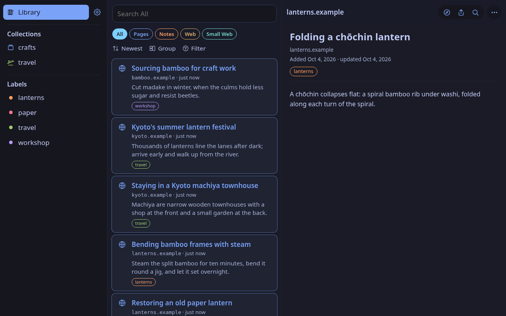
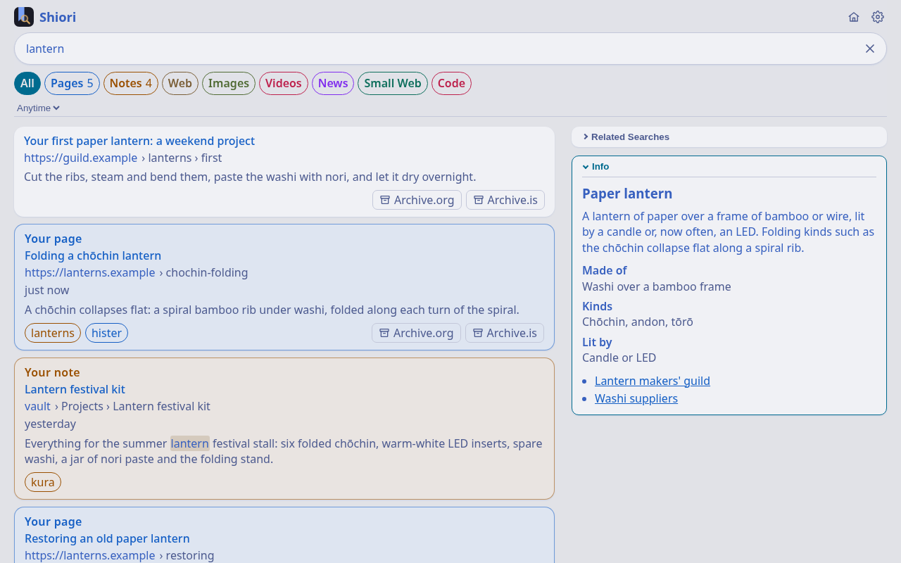

# Shiori 栞

Shiori (栞, "bookmark") is [Hister](https://github.com/asciimoo/hister) for Safari on iPhone, iPad, and Mac: a native app to search your Hister server, plus the Safari extension that feeds it. On Firefox and Chrome, use upstream Hister's own extension ([Firefox](https://addons.mozilla.org/firefox/addon/hister/), [Chrome](https://chromewebstore.google.com/detail/hister/cciilamhchpmbdnniabclekddabkifhb)).

Hister is a self-hosted personal search engine: its browser extension sends the full text of every page you visit (except the ones you skip) to your own Hister server, so you can search your history later. Upstream ships extensions for Firefox and Chrome only and has declined Safari support in-tree ([issue #49](https://github.com/asciimoo/hister/issues/49)). iOS only loads extensions that ship inside a signed app, so Shiori is that app.

> **Unofficial.** Shiori is not affiliated with or endorsed by the Hister project.

**Part of Machiya.** Shiori is one of the [Machiya](https://github.com/machiya-kobo/machiya) services, small self-hosted apps around one person's own Hister; each is called a *room*: Kura (a notes search and reader), Konbini (a project board), Niwa (a published notes garden) and Shiori. Shiori needs only a Hister server; the other rooms are optional, and where these docs say *owner* they mean the person the install belongs to.

<p>
  
  
</p>
<p>
  
  
</p>

The web app and Shiori with the Quickstart's sample pages; the Info card and web results are invented too (`tools/screenshots` makes them).

## Quickstart

Two ways to try Shiori: **A. standalone**, with nothing but a Hister server and invented sample pages, or **B. as one of the Machiya services**, next to Kura, Konbini, Niwa and SearXNG. Every block marked `quickstart:` below is run, exactly as written, by `tools/quickstart-test` on clean machines (Debian for all of it, OpenBSD, FreeBSD and NetBSD for the web pages), so these are the commands that were tested.

**Not machine-tested:** the Mac, iPhone and iPad apps (they need Xcode, a signing team and a device) and, on Linux, Cinnamon's menu search and hotkey (they need a desktop session). Their steps are below and in [Build](#build) and [docs/linux.md](docs/linux.md), checked by hand.

**You need:** `git`, `bash`, `python3` and `curl`; `podman` (or `docker`) for Hister; Debian (or any Linux with Flatpak) for the Linux app. Ports 4433, 8765 and 8766 on this machine must be free. On a fresh machine, install them with its packages:

*Debian or Ubuntu* (everything, the Linux app included):

<!-- quickstart: packages-debian -->
```bash
sudo apt-get update
sudo apt-get install -y git curl python3 podman flatpak flatpak-builder dbus-bin
```

On the BSDs, run the package block as root: a fresh FreeBSD or NetBSD has no `sudo`, and OpenBSD's `doas` needs an `/etc/doas.conf` first.

*OpenBSD* (the web pages):

<!-- quickstart: packages-openbsd -->
```bash
pkg_add python%3 git curl bash
```

*FreeBSD* (the web pages):

<!-- quickstart: packages-freebsd -->
```bash
pkg install -y python3 git curl bash
```

*NetBSD* (the web pages; its packages name Python by version, so give it a `python3`):

<!-- quickstart: packages-netbsd -->
```bash
export PKG_PATH="https://cdn.NetBSD.org/pub/pkgsrc/packages/NetBSD/$(uname -p)/$(uname -r | cut -d_ -f1)/All"
pkg_add python313 git-base curl bash
ln -sf /usr/pkg/bin/python3.13 /usr/pkg/bin/python3
```

The BSDs have no podman or docker for Hister: run it on another machine (or natively, as Machiya's [docs/install/bsd.md](https://github.com/machiya-kobo/machiya/blob/main/docs/install/bsd.md) describes) and point step 2's `HISTER_URL` at it. Without a Hister, the results check below has nothing to show.

Then get the code (`git clone https://github.com/machiya-kobo/shiori && cd shiori`); the Mac and iOS builds also need `git submodule update --init` (the Safari extension is built from Hister's own).

### A. Standalone, with sample pages

**1. A Hister with sample pages.** Hister in a container, listening on this machine only:

*With podman:*

<!-- quickstart: hister-podman -->
```bash
podman run -d --name shiori-hister -p 127.0.0.1:4433:4433 \
  -e HISTER__SERVER__ADDRESS=0.0.0.0:4433 -e HISTER__SERVER__BASE_URL=http://localhost:4433 \
  ghcr.io/asciimoo/hister:v0.20.0
```

*With docker:*

<!-- quickstart: hister-docker -->
```bash
docker run -d --name shiori-hister -p 127.0.0.1:4433:4433 \
  -e HISTER__SERVER__ADDRESS=0.0.0.0:4433 -e HISTER__SERVER__BASE_URL=http://localhost:4433 \
  ghcr.io/asciimoo/hister:v0.20.0
```

Then fill it with a dozen invented pages from the sample's paper-lantern workshop and Kyoto trip (the script only writes to a Hister on this machine):

<!-- quickstart: seed -->
```bash
tools/quickstart/seed-hister.py http://127.0.0.1:4433/
```

<!-- quickstart-expect: seed -->
```text
Added 12 sample pages to http://127.0.0.1:4433/
```

**2. The search page and the web app**, built and served the way a real host routes them (bash and Python 3, nothing else):

<!-- quickstart: pages-build -->
```bash
scripts/build-web.sh demo-site http://localhost:8765/
scripts/build-pwa.sh demo-app
```

Serve each in its own terminal (or end the line with `&`):

<!-- quickstart: serve-search background -->
```bash
HISTER_URL=http://127.0.0.1:4433/ web/dev-server.py demo-site
```

<!-- quickstart: serve-app background -->
```bash
HISTER_URL=http://127.0.0.1:4433/ PORT=8766 web/dev-server.py demo-app
```

Check that both answer, and that Hister is reached through them:

<!-- quickstart: pages-check -->
```bash
curl -s http://localhost:8765/_shiori/opensearch.xml | grep -o '<ShortName>[^<]*</ShortName>'
curl -s http://localhost:8766/manifest.webmanifest | python3 -c 'import json,sys; print(json.load(sys.stdin)["name"])'
```

<!-- quickstart-expect: pages-check -->
```text
<ShortName>Shiori</ShortName>
Shiori
```

<!-- quickstart: results-check -->
```bash
curl -s 'http://localhost:8765/search?format=json&query=%7B%22text%22%3A%22lantern%22%7D' \
  | python3 -c 'import json,sys; print(*sorted(d["title"] for d in json.load(sys.stdin)["documents"]), sep="\n")'
```

<!-- quickstart-expect: results-check -->
```text
Bending bamboo frames with steam
Candle or LED inside a paper lantern?
Folding a chōchin lantern
Kyoto's summer lantern festival
Restoring an old paper lantern
```

Now open <http://localhost:8765/?q=lantern>: Shiori lists those pages under **Your Pages** (and says no web search is set up: that needs SearXNG, part B). <http://localhost:8766/> is the web app: its Library has all twelve, and the sidebar their labels (`lanterns`, `paper`, `travel`, `workshop`). For a real host, [web/README.md](web/README.md) has the routing table.

**3. Shiori for Linux** (Debian 13 here; any distribution with Flatpak works the same): the GNOME runtime it builds on, and the app itself, installed for your user:

<!-- quickstart: linux-build -->
```bash
flatpak remote-add --user --if-not-exists flathub https://dl.flathub.org/repo/flathub.flatpakrepo
flatpak install --user -y flathub org.gnome.Platform//49 org.gnome.Sdk//49
linux/flatpak/build.sh
```

The bundle (`shiori.flatpak`, to install elsewhere) lands in `~/.cache/shiori-flatpak/`.

Tell it where Hister and the web app are, and search from the command line as the desktop search does (over SSH, with no desktop, put `dbus-run-session --` in front of `flatpak run`). This writes `~/.config/shiori/config.json`: if you already have one, back it up first (`cp ~/.config/shiori/config.json ~/.config/shiori/config.json.bak`).

<!-- quickstart: linux-check -->
```bash
mkdir -p ~/.config/shiori
echo '{"webApp": "http://localhost:8766/", "server": "http://127.0.0.1:4433/"}' > ~/.config/shiori/config.json
flatpak run io.github.machiya_kobo.Shiori provider-search lantern \
  | python3 -c 'import json,sys; print(*sorted(r["name"] for r in json.load(sys.stdin)), sep="\n")'
```

<!-- quickstart-expect: linux-check -->
```text
Bending bamboo frames with steam
Candle or LED inside a paper lantern?
Folding a chōchin lantern
Kyoto's summer lantern festival
Restoring an old paper lantern
```

`flatpak run io.github.machiya_kobo.Shiori` opens the window on the web app; `linux/install-desktop.sh` adds the `shiori` command and, on Cinnamon, the menu search and Ctrl+Alt+Space; it changes your running desktop session's settings, and `--remove` undoes it ([docs/linux.md](docs/linux.md)).

**4. The Mac, iPhone and iPad apps** (not machine-tested). On a Mac with Xcode 27 and [Homebrew](https://brew.sh): `git submodule update --init`, `brew bundle`, `cp local.yml.example local.yml`, and in `local.yml` set `DEVELOPMENT_TEAM` (Xcode → Settings → Accounts), `SHIORI_BUNDLE_PREFIX` (a reverse-DNS prefix of your own, such as `io.github.you`) and `SHIORI_SERVER_URL` (`http://<this machine's address>:4433/`). Then `scripts/install-mac.sh` installs the Mac app, and `scripts/deploy-device.sh` an iPhone or iPad (`DEVICE_NAME` in `local.env`). Turn the Safari extension on as in [Turn it on](#turn-it-on).

**Stop:** end the two servers (Ctrl+C), then remove Hister:

<!-- quickstart: stop-podman -->
```bash
podman rm -f shiori-hister
```

<!-- quickstart: stop-docker -->
```bash
docker rm -f shiori-hister
```

### B. As one of the Machiya services

Clone `machiya`, `kura`, `niwa`, `konbini` and `shiori` side by side in one directory, and bring the stack up with the [Machiya Quickstart](https://github.com/machiya-kobo/machiya#quickstart): Hister, SearXNG, Kura with the sample vault, Konbini and Niwa on this machine's ports. The reference stack starts with no sign-in (no Hister users, no identity file). Then, in `shiori`, build the pages with the rooms' addresses (the stack's defaults; change them if yours differ). `SHIORI_NIWA_URL` is your Kura (the name is older than Kura):

<!-- quickstart: stack-pages-build -->
```bash
export SHIORI_NIWA_URL=http://localhost:8083/ SHIORI_KONBINI_URL=http://localhost:8081/
export SHIORI_ROOMS="kura=http://localhost:8083/,konbini=http://localhost:8081/,niwa=http://localhost:8082/,hister=http://localhost:4433/,searxng=http://localhost:8888/"
scripts/build-web.sh demo-site http://localhost:8765/
scripts/build-pwa.sh demo-app
```

Serve them, routed to every room:

<!-- quickstart: stack-serve-search background -->
```bash
HISTER_URL=http://127.0.0.1:4433/ SEARXNG_URL=http://127.0.0.1:8888/ KURA_URL=http://127.0.0.1:8083/ \
  KONBINI_URL=http://127.0.0.1:8081/ web/dev-server.py demo-site
```

<!-- quickstart: stack-serve-app background -->
```bash
HISTER_URL=http://127.0.0.1:4433/ SEARXNG_URL=http://127.0.0.1:8888/ KURA_URL=http://127.0.0.1:8083/ \
  KONBINI_URL=http://127.0.0.1:8081/ PORT=8766 web/dev-server.py demo-app
```

The notes come from Kura, through the same host:

<!-- quickstart: stack-check -->
```bash
curl -s 'http://localhost:8765/kura/api/search?q=lantern&limit=50' \
  | python3 -c 'import json,sys; print(*sorted(r["title"] for r in json.load(sys.stdin)["results"]), sep="\n")' | grep -x 'Lantern festival kit'
```

<!-- quickstart-expect: stack-check -->
```text
Lantern festival kit
```

<http://localhost:8765/?q=lantern> now has **Your Notes** from the sample vault (the stack's Hister holds the notes and nothing else; for pages too, fill it with part A's `tools/quickstart/seed-hister.py http://127.0.0.1:4433/`) (each with its Kura page and Konbini card) and the web from SearXNG; the web app's Notes tab lists the vault, and the house button switches between the rooms. Add `SHIORI_SMALLWEB_URL` (and a `SMALLWEB_URL` route) for Gemini and Gopher, and `SHIORI_SOURCE_URL` (your fork's address) for the About page's Source link. The Linux app takes Kura the same way (this replaces `~/.config/shiori/config.json` again: back up your own first):

<!-- quickstart: stack-linux-check -->
```bash
mkdir -p ~/.config/shiori
echo '{"webApp": "http://localhost:8766/", "server": "http://127.0.0.1:4433/", "kura": "http://127.0.0.1:8083/"}' > ~/.config/shiori/config.json
flatpak run io.github.machiya_kobo.Shiori provider-search lantern \
  | python3 -c 'import json,sys; print(*sorted(r["name"] for r in json.load(sys.stdin) if r["kind"] == "note"), sep="\n")' | grep -x 'Lantern festival kit'
```

<!-- quickstart-expect: stack-linux-check -->
```text
Lantern festival kit
```

The Mac and iOS apps take the same addresses in `local.yml` (`SHIORI_SEARXNG_URL`, `SHIORI_NIWA_URL`, `SHIORI_KONBINI_URL`, `SHIORI_SMALLWEB_URL`) or in their Settings.

**Signing in.** With Hister's users on, see [Sign in to Hister](#sign-in-to-hister); with Machiya's identity file
on, [Sign in to Machiya](#sign-in-to-machiya).

## Sign in to Hister

Shiori needs no sign-in while Hister has no users (the default). When Hister has them (`app.user_handling`, v0.20.0+,
with Machiya's sign-in helper on Hister's host), each Shiori signs in once:

- **The apps:** Settings → Account → Sign in to Hister (shown only while Hister has users): first **Sign In with
  Tailscale** when Hister offers its OIDC sign-in, else **Sign In with Saved Password** (Hister's page, where your saved
  password is offered), or a name and password. Both stay in the Keychain.
- **Safari's extension** can't use the sign-in: paste your Hister user's token in the app (Settings → Account → Safari
  Extension Token) on each device with the extension, and it takes the token from there.
- **The hosted pages** send you to Hister's sign-in when it asks, and back.
- **Linux:** `shiori sign-in` (a small window), `shiori sign-out`, and `"histerToken"` in config.json.
- **Haiku:** Settings → Sign In…, and `"histerToken"` in config.json.

The session goes only to your Hister. The rooms (Kura, Konbini) get an opaque id when you're signed in, else the token, so
they know who's asking; nothing goes anywhere else. [docs/signing-in.md](docs/signing-in.md)
has the details.

## Sign in to Machiya

The Machiya rooms run without a sign-in unless their owner turns on Machiya's identity file (off by default). When
they do, Kura and Konbini ask who is calling, and each Shiori signs in once, on its own:

- **With a pairing code** (easiest): on the server, `python3 -m vaultkit.identity pair <you> --label iPhone` shows a
  one-time code for ten minutes; type it into Shiori, which trades it with Kura for a device token.
- **Or with a token** from `python3 -m vaultkit.identity token mint <you> --label iPhone`, pasted in.

Where: the iPhone, iPad and Mac apps in Settings → Account → Sign in to Machiya (kept in the Keychain; Safari's extension
asks the app); Linux as `"machiyaToken"` in
`~/.config/shiori/config.json` (`shiori pair <code>` prints it); the hosted pages use Kura's own `/signin` cookie. The
token goes only to the configured Kura and Konbini, never to Hister or SearXNG. Sign Out deletes it from the device;
revoke it on the server. [docs/signing-in.md](docs/signing-in.md) has the details, and
[Machiya's identity guide](https://github.com/machiya-kobo/machiya/blob/main/docs/identity.md) sets up the server side.

## The app

- **Library**: everything Hister has, newest first (by when you last saw it), scrolling back to the start: All, Pages (without your notes) or Notes.
- **Labels**: your server's aliases (collections are the `@` ones, like `@reading`) and topic labels.
- **Search**: Hister's query syntax, with completions for aliases, `label:` values and operators. Results show the matching text highlighted.
- **A page**: Hister's readable copy, shown with scripts off and no referrer. You can open it, share it, edit its label, or delete it from Hister (deleting checks that exactly one page matches first). A page's images are the one thing a preview loads from elsewhere; switch off Settings → Results → Images in Previews to keep previews to your server alone (Safari's results page follows it too).
- **Search scopes**: All (your top pages, your top notes, then the web, like All in Safari's results), Hister, Notes and Web.
- **Notes**: your Obsidian notes, from Kura (a notes search and reader; optional). Search them on their own (Search → Notes). A note opens in Obsidian, with its Kura page and Konbini card a tap away.
- **Files**: the folders your Hister server watches (its [local directory indexing](https://hister.org/docs/configuration#local-directory-indexing)), on a Files pill of their own once it has some, in the apps, the web app and the search page. A file opens from Hister's copy; it's never labelled, deleted, recorded as opened or given to an AI.
- **Code**: your repos as Hister holds them (repo cards, READMEs and docs, issues, pull requests and releases, imported by a companion importer), on a Code pill of their own once Hister has some, in the apps, the web app and the search page. Filter by kind, forge, open or private; each row opens at its forge. Code is never labelled, deleted or folded, and only an on-device model may summarize it.
- **Search history**: tap a search field (in the app, or on Safari's results page) for your last 5 searches, one list for both. Switch it off, or clear it, in Settings → Results → History; it stays on the device.
- **Themes**: the Machiya rooms' ten (Tokyo Night, Solarized, Nord, Dracula, Catppuccin, Gruvbox, Rosé Pine, Kanagawa, Everforest, Ayu), each light and dark (Settings → Appearance: Theme, and Appearance to follow the system or pick one). Per device. Shiori's search page (Safari's results page and the hosted page) follows the app's, and on the hosted page it is shared with the rooms.
- **Text size**: follow the system, or pick a size for Shiori alone (Settings → Appearance), on the Mac too. It covers Safari's results page as well.
- **Settings that follow you**: signed in to Hister, the house's shared ones (Settings → Appearance: theme, appearance, text size; and the pills) and the results' options follow you to every device and every Machiya app. Addresses, sign-ins, AI and a device's own text size (Appearance → Use This Device's Size) stay on the device. The app, Safari's results page (its gear) and the extension share one copy on each device.

- **Save to Shiori** in the share sheet (iPhone, iPad, and the Mac's Share menu): save the page you're on, or a link from any app (NewsBlur, Mail, a reader's in-app browser), with an optional label. From Safari it saves the page as you see it; from other apps it downloads the page. If Hister is out of reach the page waits on the device (out of your backups), keeping the time you saved it, and Shiori sends it when it next opens; after 14 days it gives up.
- **Remember what you open**: open a result from a search and Hister puts it first the next time you search the same thing, in the app and on Safari's results page (Settings → Results → History).
- **Filters**: narrow results by date (or a custom range), site (or hide one), visits, language and type, with counts.
- **By Date**: the Library by day and month, for pages Hister saved or results you opened.
- **Feeds and export**: every search, collection and label as an RSS feed (copy it, or Subscribe in NewsBlur; all collections at once as OPML), and any results as JSON, CSV or RSS. Feeds need a companion feed service on the Hister host, not part of this repository: `GET /shiori/feed?q=<query>[&title=…][&exclude_label=…]` answering RSS 2.0 with the 50 newest matches. Without it, export still works, but the feed links don't answer.
- **Page extras**: earlier versions of a page (where the server keeps them), other ways to render it (Show As), full screen on Mac and iPad, and images shown large on tap.
- **Add Page**: save a page by its address (Library → ⋯, or ⇧⌘A on the Mac).
- **Shortcuts and Siri**: "Search Hister" and "Save URL to Hister" (with an optional label).
- **Waiting to Send** (Settings): how many pages are waiting, from Safari and from the share sheet and shortcuts.
- **Search from Safari** (on by default; Settings → Safari → Search from Safari): keep DuckDuckGo as Safari's search engine, and address-bar searches open Shiori's combined results instead, laid out like SearXNG's (info box, related searches, All/Hister/Vault/Images/Videos/News, time range, paging): your Hister pages and vault notes first, then the web from your [SearXNG](https://github.com/searxng/searxng), with web results you've already visited or kept marked. Thumbnails come only through your SearXNG's image proxy (`/image_proxy`): an image from anywhere else is never loaded, so the device never contacts the engines' image hosts. That needs SearXNG to proxy the images in its JSON too; stock SearXNG proxies only its HTML, so it needs a SearXNG plugin that adds them to the JSON (not part of this repository; without it the results have no thumbnails). `!bangs` still go to DuckDuckGo, and if SearXNG can't be reached your own pages stay (or, with none, you land on DuckDuckGo as usual).

The app talks only to the servers you configure: your Hister server and, if you set them, SearXNG, Kura, Konbini, a small-web gateway and the companion feed service, plus the AI providers you switch on (Settings → AI, off by default).

## How the extension works

Shiori wraps the **official upstream extension** without forking it:

- `vendor/hister/` pins upstream as a git submodule (currently **v0.20.0**, extension 0.31.0). It is never modified.
- `scripts/build-extension.sh` builds upstream's extension with npm, then patches the built bundle for Safari:
  - `patches/manifest.shiori.json`, then `patches/manifest.safari.json`: manifest overrides (icons, name, Shiori's shortcuts, drops the `cookies` permission).
  - Prepended to `background.js`: `patches/safari-shims.js` (prebuilt toolbar icons in place of `OffscreenCanvas`, ignores Safari's internal pages), `patches/ext/host-native.js` (settings from the app), `patches/ext/core.js`, Shiori's own part (the **offline queue** (below), tagged captures and combined search), then `patches/shiori/search-core.js`, `patches/ext/badge.js` and `patches/ext/menus.js` (the toolbar count and the Mac's right-click menu).
  - `patches/safari-content-shim.js`, prepended to `content.js`: a **size cap** on captured pages.
  - `patches/safari-popup.css`, linked into `popup.html`: lets the popup fill the sheet on touch screens.
- `project.yml` ([XcodeGen](https://github.com/yonaskolb/XcodeGen)) generates one Xcode project with an iOS/iPadOS app, a macOS app, and a Safari Web Extension for each.
- `Packages/HisterKit` is the Hister API client, query suggestions and the themes, tested with `swift test`.

The popup, skip rules, "index this page", "skip this page/domain", and PDF indexing are upstream's own code.

### Safari-only behaviour

- **Offline queue.** When the server can't be reached (VPN off, no signal), a captured page is kept on the device, stamped with the time you visited it, and sent when the server answers again. This is on by default, with no error badge. The queue holds the newest 100 pages (24 M characters at most) and one entry per URL. Pages the server refuses (a skip rule, too large, or sensitive content) are dropped, not retried. The last skip rules fetched from the server still apply while offline, so skipped sites never reach the queue. Until the rules have been fetched once, nothing is queued. Queued pages never store credentials, and are dropped after 14 days. When the app's server changes, queued pages go to the new one and its skip rules are fetched at once.
- **Waiting count on the toolbar button** (the Mac): how many pages are waiting to send, and the button's tooltip says so. The app's Settings → Account → Waiting to Send shows the same.
- **Right-click menu** (the Mac; iOS has none): Search Shiori for the selected words; Save Page to Hister, Never Save This Page, Never Save This Site (upstream's own commands); Save Link to Hister, by Save This Note's Links' rules (never a file or a page Hister has, skip rules holding, `gemini://` and `gopher://` through the small-web gateway). The answer shows on the toolbar button for a few seconds.
- **Sites never saved on their own**: Safari has no containers. Turn Shiori off in a Safari profile (Safari Settings → Profiles → Extensions) and browse those sites there.
- **Size cap.** Page HTML over 2 M characters is truncated at a tag boundary, never dropped. Mobile Safari kills extensions that use too much memory. A page's text isn't sent beside its HTML, since Hister reads the text from the HTML itself (text alone, with no HTML, is capped at 1 M).
- **Tagged captures.** Every page sent carries `metadata.client: "shiori"` and `metadata.client_version`, so Hister can tell Shiori's captures from other clients' (search `metadata.client:shiori`).
- **Full-width popup** on iPhone and iPad; the Mac keeps upstream's 320px.
- **No cookies permission.** The "Authenticate with Browser Session" option in the popup won't work. Use an access token, or a server gated by your network.
- **Keyboard shortcuts**: four are suggested (Control-Shift-S save the page, P never save this page, D never this site, F open Shiori); change them in Safari Settings on the Mac.

Shiori adds no analytics. The extension talks to your Hister server and, for its search page, the servers you configure (SearXNG, Kura, the small-web gateway), plus the sites you visit (for their favicon, and for PDFs you open), exactly as upstream does.

## Build

Requires macOS with Xcode 27 or later, plus the tools in `Brewfile` (Node.js and XcodeGen).

```bash
git clone --recurse-submodules <this repo>
cd shiori
brew bundle
cp local.yml.example local.yml   # your team, bundle prefix and servers
cp local.env.example local.env   # your device name, for deploys
node --test scripts/*.test.mjs   # manifest + shim tests
(cd Packages/HisterKit && swift test)
scripts/build.sh ios             # or: scripts/build.sh macos
```

**Building it yourself.** You need a Mac with Xcode 27, the tools in `Brewfile` (`brew bundle`), and an Apple ID: a free Personal Team is enough for your own devices, re-signed every 7 days. In `local.yml` set **`DEVELOPMENT_TEAM`** (your team ID, from Xcode → Settings → Accounts) and **`SHIORI_BUNDLE_PREFIX`**, a reverse-DNS prefix of your own such as `io.github.you`. Bundle IDs are unique across Apple, so you can't reuse another build's: the app becomes `<prefix>.shiori`, its extensions `.Extension` and `.Share`, and the App Group `group.<prefix>.shiori` (iOS) or `<TeamID>.<prefix>.shiori` (macOS). The build stops until the prefix is set. Then set **`SHIORI_SERVER_URL`**, your Hister server, and optionally the other servers in `local.yml.example`; anything unset is left for the app's Settings. Clone with `--recurse-submodules`: the Safari extension is built from Hister's own (Node does that at build time).

`local.yml` also sets **`SHIORI_NIWA_URL`** (your Kura; the name is older than Kura) and **`SHIORI_KONBINI_URL`**, where notes live on the web (so results can link them), and **`SHIORI_SEARXNG_URL`**, the default SearXNG for combined search (optional). **`SHIORI_SERVER_URL`** is baked in at build time as the default server for both the app and the extension. That keeps your server's address out of the repo. Include the trailing slash. Both can still change it (the app in Settings, the extension in its popup). Unset, the extension gets upstream's `http://127.0.0.1:4433/` and the app asks for one.

To install on an iPhone or iPad, set `DEVICE_NAME` in `local.env` and run:

```bash
scripts/deploy-device.sh
```

To install on the Mac (a signed Release in `/Applications`, replacing any earlier copy):

```bash
scripts/install-mac.sh
```

Then turn Shiori on in Safari → Settings → Extensions and allow it on every website. If you used another Hister extension for Safari (such as hister-safari), turn it off, or every page is sent twice.

Never edit `Shiori.xcodeproj` (it is generated and gitignored) or `ShioriExtension/Resources/` (the staged bundle). Change `project.yml` or `patches/` instead.

## Turn it on

**iPhone / iPad:** Settings → Apps → Safari → Extensions → Shiori. Turn it on, set **All Websites** to **Allow**, and leave **Allow in Private Browsing** off. Then in Safari, tap the Page Menu button at the left of the address bar → Shiori to check the server address.

**Mac:** open Shiori, click **Open Safari Extensions Settings…**, turn on Shiori, and allow it on every website. A build signed with your team stays enabled. An ad-hoc build needs Develop → Allow Unsigned Extensions after every Safari restart.

## Linux

Shiori for Linux is a small GTK app (GJS, GTK 4, libadwaita, WebKitGTK) that adds what a web page can't do to the web app: Cinnamon's menu search, a quick-search window on a hotkey, `shiori save <url> [label]` with an offline queue, and saving a note's links. It ships as a Flatpak on the GNOME 49 runtime; [docs/linux.md](docs/linux.md) has the details.

```bash
flatpak remote-add --user --if-not-exists flathub https://dl.flathub.org/repo/flathub.flatpakrepo
flatpak install --user flathub org.gnome.Platform//49 org.gnome.Sdk//49   # needs flatpak-builder too
linux/flatpak/build.sh                 # builds, installs for you, and writes a single-file bundle
linux/install-desktop.sh               # the `shiori` launcher, Cinnamon's menu search, Ctrl+Alt+Space
```

Then tell it where your servers are, in `~/.config/shiori/config.json`:

```json
{"webApp": "https://<your Shiori web app>/", "server": "https://<your Hister>/", "kura": "https://<your Kura>/"}
```

`linux/install-desktop.sh --remove` undoes the desktop pieces. A bundle someone built for you installs with `flatpak install --user shiori.flatpak`.

## Haiku

Shiori for Haiku is a native C++ app on the Be API: search your pages and notes (All, Pages, Notes, Code), preview a note from Kura, save a web page to Hister (with an offline outbox), and quick-search from the Deskbar. Install the `.hpkg` from a release (`pkgman install ./shiori-*.hpkg`), or build it on Haiku with `cd haiku && make && ./package.sh`; [docs/haiku.md](docs/haiku.md) has the details.

## Hosting the web pages

Shiori's search page and the web app are plain static files that any browser can use and install. Build them with `scripts/build-web.sh` and `scripts/build-pwa.sh`, and serve them from one host that also routes, on the same origin, to your Hister server, SearXNG, and optionally Kura, Konbini, the small-web gateway and the AI endpoint. Pass requests through unchanged, keep the host reachable only by you (your network or VPN is the gate; with Hister's users on, its nginx also signs Hister's calls in, web/README.md), and set the build's environment for the options you use. [web/README.md](web/README.md) has the routing table and the variables.

**Add Page and sharing to the web app.** Built with `SHIORI_SMALLWEB_URL` (the small-web gateway, routed at `/smallweb/`), the web app has **Add Page** (the + beside Library in the sidebar, or the Add Page tab on a phone): an address (http, https, gemini or gopher) and an optional title, sent to the gateway's `POST /api/save`, which fetches the page and saves it in Hister. Installed from a browser that supports it (Chrome or Edge, on Android or a computer), the app also appears in the system's share menu: sharing a link opens Add Page filled in, and nothing is saved until you tap Save. The gateway answers before it fetches, so the app says "Saving…", not "Saved". Kura's notes are never sent (notes live in Kura, and a private vault's `/v/<vault>/` address is refused in every form). The gateway must accept this host's origin: put the web app's address in its `SMALLWEB_ORIGINS`. Without the gateway there is no Add Page and no share target.

## Updating upstream

```bash
git -C vendor/hister fetch --tags
git -C vendor/hister checkout vX.Y.Z
scripts/build-extension.sh && node --test scripts/*.test.mjs
git add vendor/hister
```

The build fails if upstream asks for a new permission or moves its default server URL, so a bump can't change either unnoticed. Shiori's icons (app, Light alternate, extension) come from `scripts/generate-shiori-icons.py`.

## Credits and license

- [Hister](https://github.com/asciimoo/hister) by Adam Tauber (asciimoo) and contributors: the extension this app ships.
- [hister-safari](https://github.com/nburns/hister-safari) by Nick Burns: the macOS Safari port whose build pipeline, manifest merge, and background shim Shiori started from.

Copyright (C) 2026 Micheal Waltz and Machiya contributors.

Contributions are welcome: see [CONTRIBUTING.md](CONTRIBUTING.md), and [SECURITY.md](SECURITY.md) to report a vulnerability privately.

Shiori is free software under the GNU Affero General Public License, version 3 or (at your option) any later version ([AGPL-3.0-or-later](LICENSE)), matching both. The third-party software it ships or uses (the Hister extension's bundled libraries and fonts, the logos, the platform libraries) is listed with its licences in [`THIRD_PARTY_NOTICES`](THIRD_PARTY_NOTICES).
