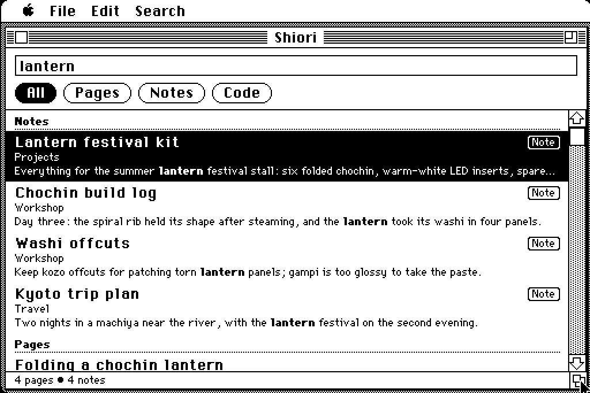
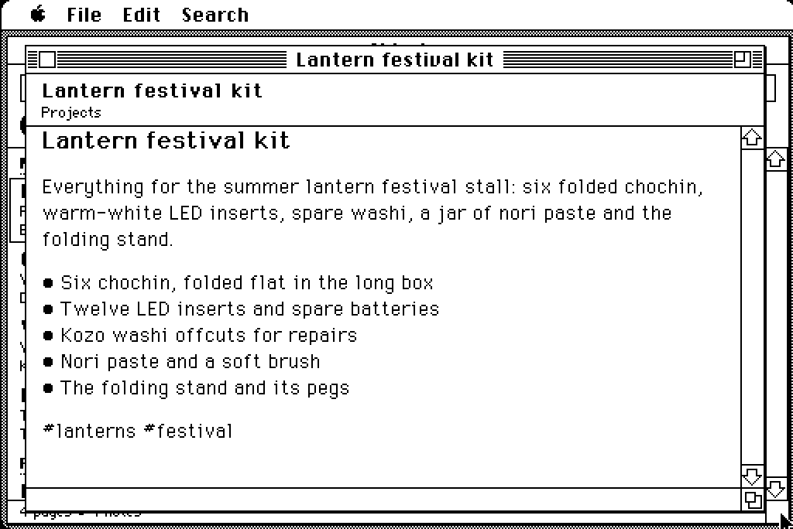
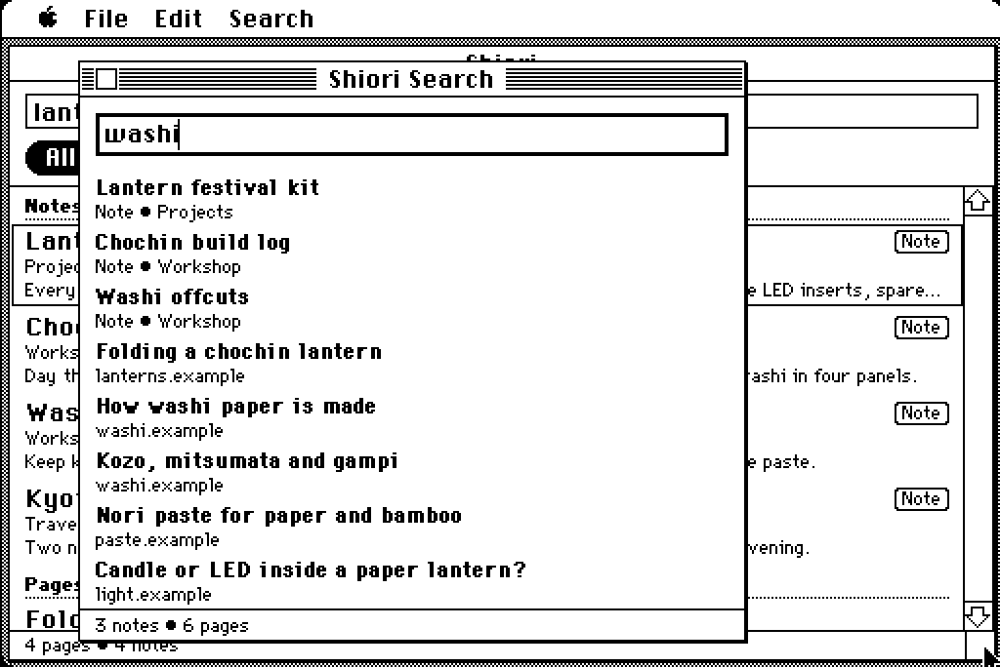

# Shiori for Classic Macintosh

A native Shiori for 68k Macs, from a Mac Plus on System 6 to a color Mac
on System 7: search your pages in Hister and your notes in Kura, read a
result in its own window, and quick-search from the Apple menu. Written in
C with [Retro68](https://github.com/autc04/Retro68); the code is in
[`classic/`](../classic).

<p align="center"> </p>

## What it needs

- A Mac with a 68000 or later and 1 MB free for Shiori (640 KB at least),
  System 6.0.8 or System 7.x, and MacTCP 2.0.6 or later on Ethernet (a
  Mac Plus works with a BlueSCSI or other DaynaPORT-compatible SCSI
  Ethernet).
- **A way to Hister without TLS.** MacTCP has no TLS and Shiori here looks
  up no names, so it speaks plain HTTP/1.0, by IP address. Either:
  - **Directly to Hister**, served over plain HTTP on your LAN (below).
    The simplest setup: Shiori is then an ordinary Hister client, with or
    without Hister's access token. Kura is optional: without it, notes come
    from Hister.
  - **Through mac-bridge** ([`classic/bridge/`](../classic/bridge)), when
    your Hister is HTTPS-only or signed in with users. It needs Machiya's
    sign-in helper,
    [hister-login](https://github.com/machiya-kobo/machiya/blob/main/docs/services/hister-login.md),
    which Machiya's reference compose doesn't run yet: without it, go
    directly. The bridge listens
    on your LAN, one port for Hister and one for Kura, passes a few
    read-only paths on over HTTPS, and holds Hister's token itself. The Mac
    holds only a **room token** (`mht_…`, from the sign-in helper's
    sessions page, with the scopes `kura` and the bridge's): the bridge
    checks it with the helper on both ports, then passes it to Kura (which
    checks it too) or swaps in Hister's own token, which never reaches the
    LAN. List your Mac's
    address in `BRIDGE_ALLOW`.

## Installing

From a release, use the `.dsk` (an 800K floppy image, for a BlueSCSI's SD
card, an emulator or a floppy), the `.sit` (StuffIt 1.5) or the `.hqx`
(that archive in BinHex, to download on the old Mac; StuffIt Expander opens
it). Each holds three files:

- **Shiori**: the application. Copy it anywhere.
- **Shiori Search**: the desk accessory, as a Font/DA Mover suitcase. On
  System 6, install it into the System file with Font/DA Mover. On
  System 7, double-click it and drag *Shiori Search* to the System Folder
  (or the Apple Menu Items folder). Shiori's own Apple menu carries it
  too, without installing anything.
- **About Shiori**: a short read-me.

## Settings

File → Preferences…: how to reach Hister (*Through mac-bridge* or
*Directly (HTTP)*), Hister's and Kura's addresses
(`http://<IP address>:<port>/`; Kura's may be empty), the room token,
Hister's token (direct only), and the reader's text size. On first launch
the dialog opens on its own. They're kept in *Shiori Preferences* (the
Preferences folder on System 7, the System Folder on System 6), on this
Mac only. The tokens are in that file in clear, since classic Mac OS has
no keychain: keep it off shared disks. The desk accessory reads the same
file.

## What it does

- **Search** (Return, or a pill): **All** (your top notes, then your
  pages), **Pages**, **Notes** and **Code**. Nothing searches while you
  type. *Show More* ends a list that has another page.
- **Notes** come from Kura (the default vault, or a shared one from the
  vault menu) or from Hister (the default vault only): Preferences → Notes
  from. Until you choose, Kura when one is set up.
- Not in this app: Files, Small Web, the web, AI and saving.
- **Readers**: a result opens in its own window (up to three): a note from
  Kura (never cached), or Hister's readable copy when notes come from
  Hister; a page from Hister's readable copy. Headings, bold, italic, code, quotes, lists and links are styled.
  A link to another note in the same Kura opens it there; any other link
  shows its address, and Copy Link copies it (there's no browser).
  Find (⌘F) and Find Again (⌘G) search the text.
- **Copy Link** (Edit menu): the selected result's or reader's address.

<p align="center"> </p>

- **Shiori Search**, the desk accessory: a small window in the Apple menu,
  over any application. Return searches (three notes, then your pages);
  Return or a double-click on a result opens it in Shiori's reader on
  System 7 (launching Shiori if needed) and copies its link on System 6.
- **System 7**: Balloon Help for the window and the menus, the required
  Apple events, and color: on a color screen the pills wear Shiori's
  colors and titles the accent; on a gray screen, dark grays.

Keys: Tab moves between the field and the results, ↑ ↓ choose a result,
Return opens it, ⌘1–⌘4 pick the pill, ⌘. stops a search. (A Mac Plus with
the original M0110 keyboard has no arrows: use Tab and the Search menu.)

## Hister over plain HTTP

Any client without TLS (this one, or another old machine's) can talk to
Hister directly once Hister listens on your LAN over plain HTTP. In
Hister's `config.yml`:

```yaml
server:
  address: 192.168.1.10:4433          # your server's LAN address (0.0.0.0: every interface)
  base_url: http://192.168.1.10:4433/
app:
  access_token: "a-long-random-string"  # optional, but see below
```

(Or `HISTER__SERVER__ADDRESS`, `HISTER__SERVER__BASE_URL` and
`HISTER__APP__ACCESS_TOKEN` in its environment, as in a container.) A
client sends `Origin: hister://` and, with an access token set, the token
as `X-Access-Token` (or `Authorization: Bearer`). In Shiori's Preferences:
*Directly (HTTP)*, Hister's address, and *Hister's token* when you set one.

**Know what it exposes.** Over plain HTTP everything crosses your network
unencrypted: your searches, the pages you read and the access token.
Hister's API also writes: whoever can reach the port (without a token)
or has seen the token (with one) can read your whole history, add pages
and delete them.

- Keep it to a network you trust, such as a wired home LAN; never on
  shared or public Wi-Fi, and never forwarded to the Internet.
- Set an access token, and limit the port to the old Mac's address with
  your firewall.
- Keep the HTTPS address for everything else (a reverse proxy can serve
  both).
- If that's more than you want to open, use mac-bridge instead: GET only,
  three paths, an address allow-list, and Hister's token stays off the LAN.

Tested with Hister 0.20.0: with no token, with `app.access_token`, and
with users on (`app.user_handling`), where each user's own token works
the same way (`hister update-user <name> --regen-token` makes one).

## What stays private

- Each request carries one credential at most, and only to the two
  addresses you set (by origin), never across a redirect (Shiori follows
  none). Through the bridge, the room token goes to both bridge ports and
  Hister's token is never sent. Directly, Hister's token goes to Hister
  only (`X-Access-Token`) and the room token to Kura only.
- A note's vault comes from its address. Notes searches only the default
  vault and vaults Kura marks shared; a private vault is never offered,
  and the bridge, when you use one, refuses any vault not on its list. The desk accessory
  searches the default vault only, and Shiori refuses a request (an Apple
  event) to open a note from any other.
- Replies are capped (256 KB for a search, 192 KB for a reader, 64 KB in
  the desk accessory, and the bridge's own cap), and nothing is written to
  disk but Preferences.

## Building and testing

`classic/scripts/build.sh` builds the app, the desk accessory and the
suitcase with Retro68; `classic/scripts/package.sh` makes the release
files with neutral defaults. The portable core (`classic/core/`, C89) is
tested on any machine by `node --test scripts/classic.test.mjs`, and its
search queries are search-core's twins (`classic/tests/vectors.h`,
generated by `haiku/tests/gen-vectors.mjs --c`). Snow (System 6, Mac
Plus) and Basilisk II (System 7, every depth) runs are described in
[`classic/docs/TESTING.md`](../classic/docs/TESTING.md).
